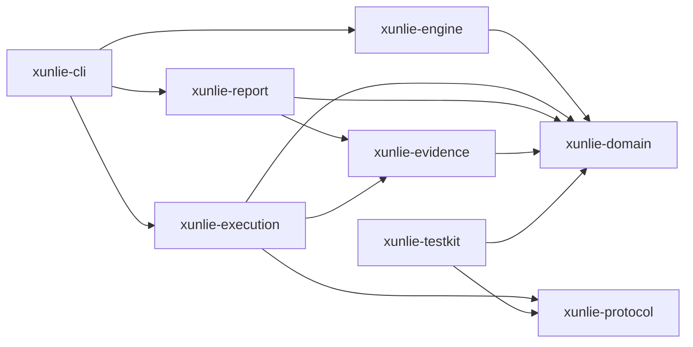
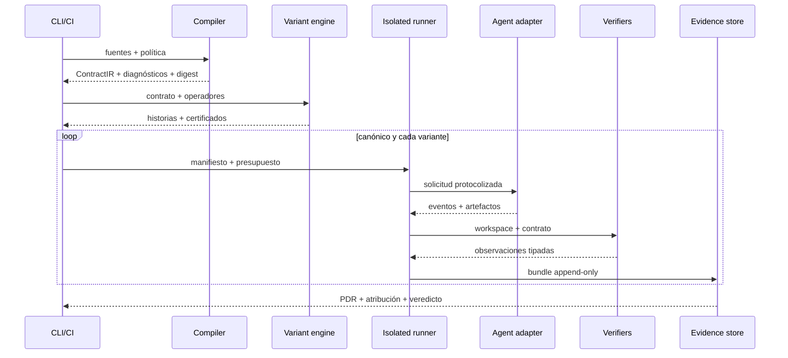

# Baseline de arquitectura de Xunlie

**ID:** `XUNLIE-ARCH-001`  
**Versión:** `0.1.0`  
**Estado:** propuesta  
**Sustituye:** arquitectura de InvariantCI  
**Propietario:** Chief Architect

## 1. Propósito y frontera

Xunlie mide si agentes de software implementan el mismo contrato final de forma estable cuando cambia la historia de instrucciones, su orden o su presentación, pero no su semántica autorizada. Produce un veredicto reproducible y un paquete de evidencia auditable.

Incluye en v1:

- compilación de requisitos y restricciones en un `ContractIR` canónico;
- resolución explícita de historias de especificación;
- generación certificada de variantes equivalentes;
- ejecución aislada y presupuestada de agentes;
- verificadores enchufables;
- captura de evidencia, comparación pareada y `Path Divergence Rate` (PDR);
- CLI, reporte y gate para CI.

No incluye en v1:

- prueba matemática de equivalencia de programas arbitrarios;
- un IDE o plataforma general de gestión de proyectos;
- alojamiento de modelos ni entrenamiento de agentes;
- ejecución no aislada con credenciales personales;
- sustitución del sistema de tests del proyecto evaluado.

## 2. Invariantes arquitectónicos

| ID | Invariante obligatorio |
|---|---|
| `INV-ARCH-001` | El contrato efectivo se resuelve antes de ejecutar cualquier agente. |
| `INV-ARCH-002` | Una variante solo entra en una corrida si posee certificado de equivalencia válido. |
| `INV-ARCH-003` | El núcleo de dominio no accede a red, sistema de archivos, reloj, aleatoriedad global ni procesos. |
| `INV-ARCH-004` | Toda entrada que afecta un veredicto se identifica por digest, versión o ambos. |
| `INV-ARCH-005` | Ningún adaptador de agente o verificador se enlaza dinámicamente dentro del proceso de confianza. |
| `INV-ARCH-006` | Un fallo de infraestructura no se clasifica como divergencia semántica. |
| `INV-ARCH-007` | PDR se marca `inconclusive` si falla el canónico o la cobertura de oráculo es insuficiente. |
| `INV-ARCH-008` | Un reporte agregado conserva acceso a la evidencia por variante; no oculta distribuciones. |
| `INV-ARCH-009` | Presupuestos, permisos y aislamiento se aplican fuera del agente. |
| `INV-ARCH-010` | Formatos persistidos y protocolos declaran versión y política de compatibilidad. |
| `INV-ARCH-011` | Código `unsafe` está prohibido en el núcleo; cualquier excepción requiere ADR y revisión de seguridad. |
| `INV-ARCH-012` | La evidencia es append-only; una corrección genera un nuevo evento o bundle. |

## 3. Stack de referencia

### Núcleo

- **Rust, edición 2024**, toolchain estable fijado en `rust-toolchain.toml`.
- Workspace Cargo y `cargo xtask` como interfaz de automatización portable.
- `serde` para formatos, `schemars` para esquemas, `clap` para CLI, `thiserror` para errores tipados, `tracing` para eventos estructurados y SHA-256 para identidad de artefactos.
- `tokio` solo en bordes de ejecución; el dominio permanece síncrono y determinista.

### Integración

- Protocolo versionado JSON Lines por `stdin/stdout` para adaptadores de agentes y verificadores.
- Git worktrees y contenedores OCI o sandbox nativo como backends de aislamiento.
- JSON/JSONL direccionado por contenido como registro primario; SQLite solo como índice reconstruible.
- GitHub Actions como primer proveedor CI, sin introducir semántica de negocio dependiente de GitHub.

### Razón de la elección

Rust reduce estados inválidos mediante tipos, ofrece un binario portable y una superficie de runtime pequeña. Los plugins fuera de proceso aíslan fallos, dependencias y ciclos de actualización. JSONL facilita replay, streaming y auditoría. Ninguna de estas elecciones es irreversible: los protocolos y formatos, no la implementación, son el límite estable.

## 4. Componentes y dependencias permitidas



| Componente | Responsabilidad única | No puede |
|---|---|---|
| `xunlie-domain` | tipos, invariantes, resolución pura, hashes y decisiones | realizar IO o conocer CLI/proveedores |
| `xunlie-engine` | compilar contrato, generar variantes y probar precondiciones | ejecutar agentes o modificar repositorios |
| `xunlie-protocol` | mensajes versionados y negociación de capacidades | contener lógica de scoring |
| `xunlie-execution` | aislamiento, presupuesto, adaptadores, scheduling y clasificación infra | decidir equivalencia contractual |
| `xunlie-evidence` | eventos append-only, manifiestos, digests y replay | alterar evidencia previa |
| `xunlie-report` | métricas, atribución, serialización y veredicto de gate | reinterpretar resultados crudos sin regla versionada |
| `xunlie-cli` | UX, configuración y códigos de salida | incorporar lógica de dominio no reutilizable |
| `xunlie-testkit` | fixtures, agentes falsos y suites de conformidad | ser dependencia de producción |

Las dependencias inversas, ciclos y acceso de dominio a IO son fallos críticos de arquitectura.

## 5. Flujo de confianza



## 6. Contratos persistidos

Todo objeto raíz incluye:

```json
{
  "schemaVersion": "xunlie.contract/v1",
  "producer": {"name": "xunlie", "version": "0.1.0"},
  "createdAt": "RFC3339",
  "contentDigest": "sha256:..."
}
```

Objetos normativos:

- `ContractIR`: requisitos, restricciones, precedencia, fuentes y política de resolución;
- `History`: secuencia de eventos de especificación;
- `EquivalenceCertificate`: operador, precondiciones, contrato esperado y prueba ejecutada;
- `RunManifest`: digests, herramientas, entorno, permisos, semillas y presupuesto;
- `Observation`: resultado de un verificador con alcance y confianza;
- `EvidenceBundle`: manifiesto, eventos, outputs, observaciones y atestaciones;
- `GateVerdict`: regla versionada, entradas, resultado y explicación.

La serialización canónica se define con vectores de prueba. Cambiarla requiere migración explícita; jamás se reescriben bundles históricos.

## 7. Compatibilidad y extensibilidad

- Versionado SemVer para CLI y crates; versión independiente para cada esquema/protocolo.
- Cambios aditivos compatibles dentro de `v1`; consumidores deben ignorar campos desconocidos.
- Cambios de significado o eliminación elevan versión mayor del esquema.
- Un adaptador anuncia capacidades antes de una corrida; la incompatibilidad falla antes de consumir presupuesto.
- Todo plugin debe pasar la suite `xunlie-testkit conformance`.
- Herramientas nuevas entran por ADR, evaluación de riesgo, pin reproducible y periodo de observación.

## 8. Fitness functions

Se automatizan, como mínimo:

1. grafo Cargo sin ciclos ni aristas prohibidas;
2. escaneo de APIs de IO en `xunlie-domain`;
3. `unsafe_code = "forbid"` en crates de confianza;
4. snapshots y vectores de canonicalización;
5. compatibilidad hacia atrás de JSON Schema y protocolo;
6. replay determinista de corpus dorado;
7. pruebas de propiedades del resolver y operadores;
8. suite de conformidad de cada adaptador;
9. límites de tamaño y dependencias del núcleo;
10. amenaza y permisos actualizados cuando cambia una frontera.

Cada fitness function emite evidencia con un ID `EVID-*` y es obligatoria en el gate de arquitectura o construcción correspondiente.

## 9. Decisiones que requieren ADR

Requieren ADR antes de implementación: nueva dependencia de producción, cambio de frontera, formato persistido, protocolo, backend de aislamiento, mecanismo criptográfico, fuente de identidad, política de retención, telemetría externa o excepción a un invariante.

## 10. Riesgos arquitectónicos principales

| Riesgo | Control de diseño |
|---|---|
| Confundir variación legítima con contradicción | resolvedor formal, diagnósticos y corpus de casos conflictivos |
| Certificados débiles | precondiciones ejecutables y pruebas metamórficas |
| Contaminación entre corridas | workspace efímero, credenciales mínimas y prueba de aislamiento |
| Oráculos insuficientes | cobertura explícita y veredicto `inconclusive` |
| Deriva de modelos/herramientas | digest/config/model ID y baselines por versión |
| Reporte manipulable | evidencia append-only, hashes y atestación de release |
| Plugins inseguros | proceso separado, protocolo restringido y permisos declarados |

## 11. Referencias de requisitos

La realización arquitectónica completa está en `quality/traceability.json`. Los requisitos `REQ-F-001` a `REQ-F-012` y `REQ-Q-001` a `REQ-Q-012` deben mapear a componente, prueba y gate antes de entrar a construcción.

