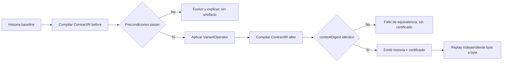

# Variantes certificadas M2

M2 transforma historias de especificación y conserva el contrato efectivo. La unidad portable es
un documento `xunlie.certified-variant/v1` con fuentes transformadas y un
`xunlie.equivalence-certificate/v1` anidado.

## Flujo fail-closed



La comparación semántica usa el `contentDigest` del contrato. Los cambios legítimos en los bytes
de fuente quedan visibles porque `historyDigest` y `artifactDigest` deben cambiar. Tanto el bundle
como el certificado poseen un `contentDigest` propio; la CLI reporta el segundo como
`certificateDigest` para evitar confundirlo con el digest contractual.

## CLI

```console
xunlie variant history.json \
  --operator reverse-independent-adds \
  --out certified-variant.json \
  --format json

xunlie verify-variant history.json certified-variant.json --format json
```

Operadores disponibles:

| CLI | Identidad persistida | Dominio seguro |
|---|---|---|
| `normalize-json` | `json.presentation.normalize@1.0.0` | todas las fuentes son JSON válido y la normalización cambia bytes |
| `reverse-independent-adds` | `history.independent-adds.reverse@1.0.0` | una fuente con dos o más `add` sobre ids distintos |

Una exclusión devuelve código `14` y diagnósticos `XUNLIE-VARIANT-PRECONDITION-FAILED`. Un
certificado inválido, un replay distinto o un intento de cambiar el contrato devuelve código `15`.
Ninguno escribe una variante parcial.

## Verificación y pruebas

- `TEST-VARIANT-META`: propiedades sobre inversiones de requisitos independientes.
- vector golden `certified_variant_v1.json`: bytes, esquema y digests estables;
- casos negativos: historia dependiente, input sin cambio, certificado/fuente alterados y operador
  que intenta modificar semántica;
- `cargo-mutants`: campaña dirigida sobre los módulos de certificado y generación.

El certificado prueba igualdad contractual, no cobertura de oráculos. Un resultado de agente solo
podrá considerarse equivalente cuando M4/M5 añadan observaciones y reglas de suficiencia; hasta
entonces `RISK-002` permanece abierto.
