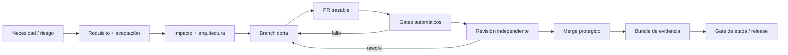

# Ciclo de desarrollo controlado

## Flujo por incremento

## 1. Intake y refinamiento

Todo cambio nace como issue tipado: feature, defecto, riesgo, arquitectura, dependencia o proceso. Se identifica la necesidad, usuario/amenaza, resultado esperado y urgencia. Product y Quality convierten la necesidad en criterio observable.

La IA puede proponer requisitos o código, pero el responsable humano confirma intención, procedencia y criterios.

## 2. Análisis de impacto

Antes de construir se identifican requisitos, componentes, contratos, seguridad, privacidad, compatibilidad, documentación, datasets, operación y rollback afectados. Si cambia una decisión estructural se aprueba un ADR antes de código.

## 3. Construcción

- ramas cortas desde `main`;
- commits coherentes y firmados;
- cambios pequeños, sin mezclar refactor no relacionado;
- tests y documentación en el mismo PR;
- dependencias nuevas separadas para revisar procedencia/licencia;
- generación local de los mismos controles que CI mediante `cargo xtask quality`.

## 4. Pull request

La plantilla exige IDs de requisito, riesgo, arquitectura y evidencia. El autor declara uso de IA, fuentes y validación efectuada cuando sea material. Bots no aprueban cambios; solo aportan evidencia.

La revisión considera corrección, estados de fallo, responsabilidad del componente, observabilidad, seguridad, mantenibilidad y simplicidad. Los comentarios críticos deben resolverse, no solo responderse.

## 5. Integración

Merge queue o branch actualizada ejecutan los checks sobre el commit real a integrar. Se prefiere squash para historia lineal, conservando la PR como registro de deliberación. `main` no acepta push directo.

## 6. Releases

Se usa SemVer. Release candidate y artefacto final comparten digest. El pipeline genera changelog, SBOM, checksums, atestación, firmas y evidencia. Un job/rol distinto verifica antes de publicar. Hotfix atraviesa los mismos gates; puede reducir alcance, no controles críticos.

## 7. Operación y aprendizaje

Incidentes, falsos positivos, escapes y actualizaciones de herramientas regresan al backlog como requisito, riesgo, test o CAPA. Postmortems son sin culpa, pero asignan acciones verificables. Los controles sin señal útil se mejoran mediante cambio aprobado; no se omiten ad hoc.

## Cadencias

| Frecuencia | Actividad |
|---|---|
| por commit/PR | lint, tests, trazabilidad, arquitectura, SAST y evidencia |
| semanal | triage de riesgos, flaky tests, findings y dependencias urgentes |
| mensual | actualización controlada de toolchain/dependencias y muestreo de auditoría |
| trimestral | arquitectura, threat model, métricas, estado del arte y eficacia del SQ Plan |
| por release | G4/G5, SBOM/provenance, recuperación y audit trail |

